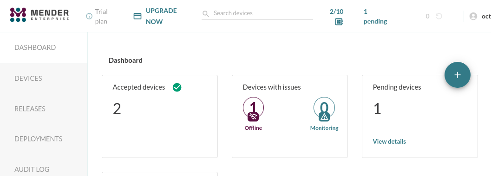
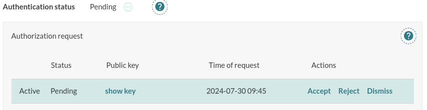
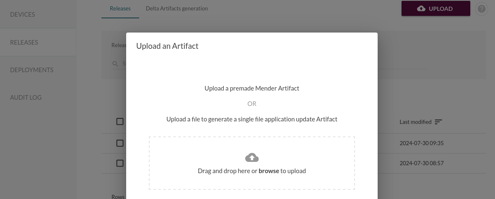
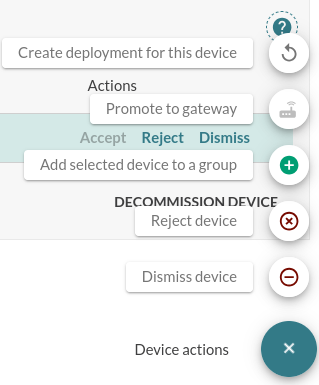
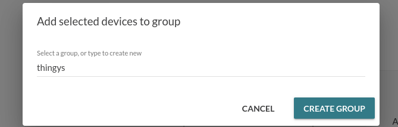

# Enabling the Mender FOTA plugin in the 1NCE portal

1. Navigate to the [1NCE OS Portal](https://portal.1nce.com/portal/customer/connectivitysuite) and login with your credentials.  

2. Make sure you are at the "1NCE OS" tab and search for the "Plugins" tab on the left side of the screen.  

3. Click on "Mender Firmware Over-the-Air Management" and install the Mender Plugin.  

4. Next you will be prompted to enter your oranganization token from the Mender Portal. If you haven't already setup an account then follow the steps on [Getting the Organization token](#getting-the-organization-token).   
After you have done that proceed with step 5.   

5. Once obtained your token paste it into the text box displayed below and press "Next".   
6. The installation on the 1NCE side should be done. Continue with [Connecting a Device to Mender](#connecting-a-device-to-mender)


# Setting up the Mender FOTA Features

## Getting the Organization token

1. Go to the [Mender portal](https://eu.hosted.mender.io/ui/).  
2. Create an account following the steps on the screen or login to your account if you already have one.  
3. Click on your profile on the top right corner and click "My profile".   
4. Go to "Organization and billing", search for the "Organization token" and copy that.  

## Connecting a Device to Mender

To actually connect a device to Mender you can use a firmware blueprint from 1NCE which will try and establish a connection to the Mender Portal.  
1. Get the blueprint [here](https://github.com/1NCE-GmbH/blueprint-zephyr/tree/main/plugin_system/nce_fota_mender_demo)  
> NOTE: you need to have a 1NCE workspace, if you don't have one follow the [Getting started with 1NCE](https://github.com/itsoctotv/how-do-i-develop-with-zephyr-1nce-blueprints/blob/main/howto.md).  
2. Build the application and flash it onto the Thingy:91.  
3. Look at the Mender Dashboard at "Devices" after some time a new device should show up, the LED on it will turn blue and it is asking you to accept the device.    
4. Click on "Pending device" and click on its ID.  
5. Under "Authorization request" hit the "Accept" button.    
6. The new device is now connected with the Mender service.    

## Create Mender Artifacts
*todo creating it*

> NOTE: For testing you can use the pre-made Mender artifacts from the blueprint under `plugin_system/nce_fota_mender_demo/thingy_binaries/` and look for the `<filename>.mender` files.  

## Upload Mender Artifacts
From the Mender Dashboard navigate to "Releases" there you'll find a "Upload" button, press it and drag-an-drop your `.mender` file(s) in there and hit "Upload Artifact".   
  

## Deploy Artifacts from Mender
1. To deploy an artifact you have to first click on the artifact you want to deploy from the "Releases" tab. After that click on the "+" symbol on the bottom right corner and select "Create a deployment for this release".  
2. Select the device group to target.  
> NOTE: you can select "All Devices" if you are just testing it but it is recommended to create a group with the device inside (even if it's just one device) because you cannot update a single device directly. To do this follow the instruction on [Create a device group](#create-a-device-group) and continue.  
3. Optionally set the start time when the release should be deployed.  
4. Click on create deployment.  
5. After that you will find the status under "Deployments" -> "Active". On "View details" you can monitor the current status of the update.  
> NOTE: If you connect to the Thingy:91 via its serial communication you'll see status messages regarding the firmware update.  
```
[INF] Waiting For Updates...                                                             
ID: 6fdd0aee-af06-40e8-a975-85989163f435                                                 
URI: c271964d41749feb10da762816c952ee.r2.cloudflarestorage.com                           
Artifact name: release-v1                                                                
Filename: mender-artifact-storage-prod-hm-eu/667a7fec1354dd34a5f824c2/d04d0f64-2c1b-452ca
[INF]Update is available...   
```
6. After some time the Thingy:91 will download the new firmware and update it you'll also see it in the deployment details that the device updated successfully.  


## Create a Device Group
From the Mender Dashboard select the "Devices" tab.  
To create a group select the device(s) you want to be in a group and click on the "+" symbol on the bottom right corner, select "Add selected device to group" and give the group a name of your choice.    
After that you will see a groups with your given name appear on the left side.    


